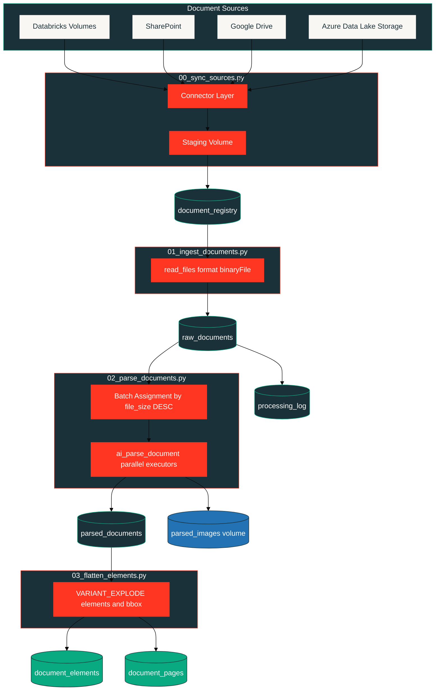
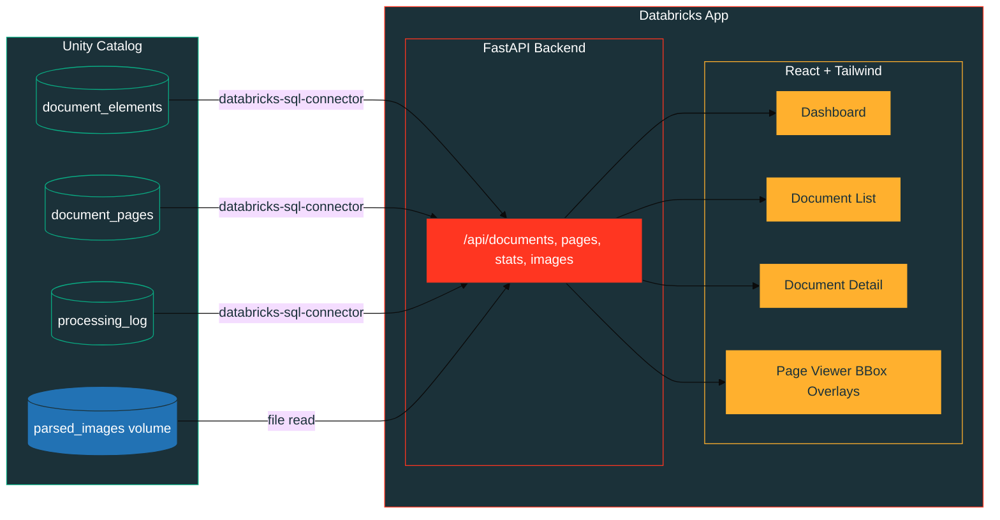
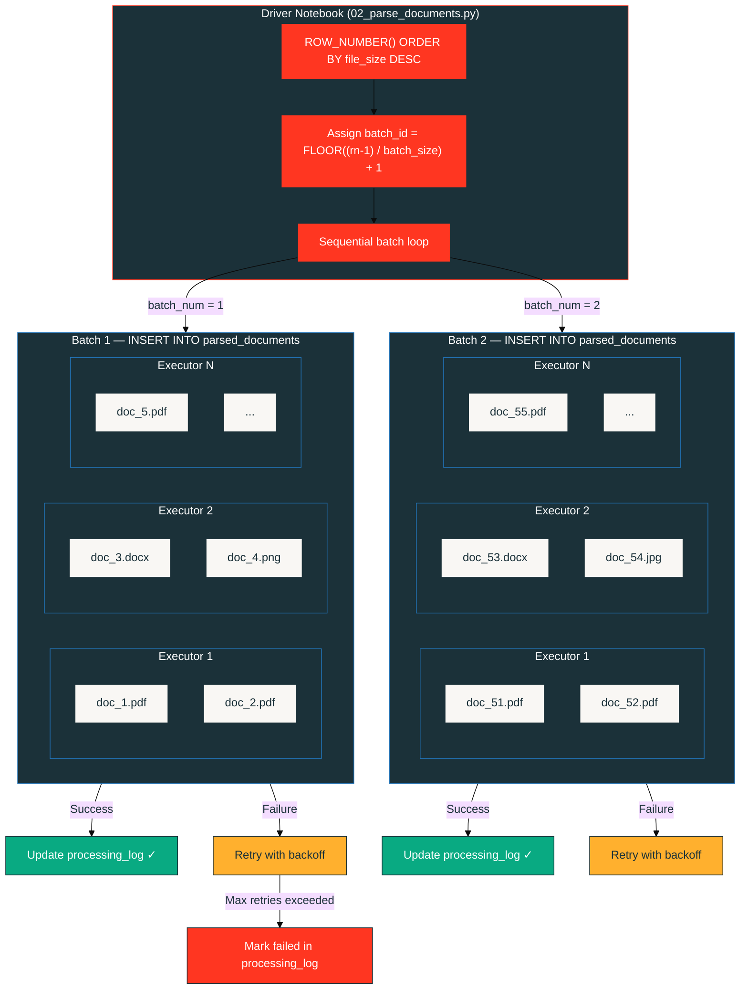

# Databricks Document Processing Pipeline

Extract text, tables, figures, and layout from documents at scale on Databricks—then inspect results in a built-in viewer. The pipeline is config-driven, runs with Databricks Asset Bundles and Unity Catalog, and uses `ai_parse_document` for parsing.

## Table of Contents

- [Usage](#usage)
- [Architecture](#architecture)
- [Repository Structure](#repository-structure)
- [Configuration](#configuration)
  - [Sources](#source-configuration)
  - [Authentication](#authentication)
- [Pipeline Stages](#pipeline-stages)
- [Distributed Batch Processing](#distributed-batch-processing)
- [Unity Catalog Assets](#unity-catalog-assets)
  - [Volumes](#managed-volumes)
  - [Tables](#tables)
- [Document Viewer App](#document-viewer-app)
- [Notes and Limitations](#notes-and-limitations)

## Usage

Prerequisites: Databricks CLI configured, Runtime 17.1+, Unity Catalog enabled, workspace in a supported AI Functions region.

### Step 1 — Clone and configure

```bash
git clone <repo-url> && cd databricks-doc-process-pipeline
```

Edit `config/pipeline_config.yml` to point at your document sources. At minimum, set a volume path:

```yaml
sources:
  - name: "my_docs"
    type: "volume"
    paths:
      - "/Volumes/main/doc_processing/raw_docs/my_folder"
    file_pattern: "*.{pdf,jpg,jpeg,png,doc,docx,ppt,pptx}"
    recursive: true
```

### Step 2 — Validate

```bash
databricks bundle validate
```

Checks `databricks.yml`, job definitions, and volume resources against the workspace.

### Step 3 — Deploy

```bash
databricks bundle deploy
```

Deploys the job, volumes, and app to the workspace tied to your active Databricks CLI profile.

The DAB has no explicit `dev`/`staging`/`prod` targets — switch Databricks CLI profiles to target different workspaces. Override variables at deploy time if needed:

```bash
databricks bundle deploy --var catalog=prod_catalog --var schema=prod_schema --var num_workers=8
```

### Step 4 — Run the pipeline

```bash
databricks bundle run doc_processing_job
```

This triggers a four-task job:

1. **Sync sources** — downloads external files to a staging volume, registers all files in `document_registry`
2. **Ingest documents** — loads binary content into `raw_documents`
3. **Parse documents** — calls `ai_parse_document` in batches, writes results to `parsed_documents` and page images to the `parsed_images` volume
4. **Flatten elements** — explodes parsed output into `document_elements` and `document_pages`

### Step 5 — Inspect results in the viewer app

Set the environment variables in `app/app.yaml` for your workspace:

```yaml
env:
  - name: DATABRICKS_WAREHOUSE_ID
    value: "your-warehouse-id"
  - name: DATABRICKS_CATALOG
    value: "my_catalog"
  - name: DATABRICKS_SCHEMA
    value: "my_schema"
```

Then redeploy and open the app:

```bash
databricks bundle deploy
```

Open the Databricks App from your workspace UI. You can browse documents, view page images, and inspect bounding boxes for every extracted element.

### Updating the frontend

If you modify the React UI, rebuild static assets before deploying:

```bash
cd app/frontend
bun install
bun run build
```

Then run `databricks bundle deploy` again.

## Architecture

### Document Processing Pipeline



### Document Viewer App



## Repository Structure

```text
.
├── app/                         # Databricks App (FastAPI + React)
│   ├── app.yaml                 #   App runtime config
│   ├── backend/                 #   FastAPI routes and models
│   ├── frontend/                #   React + Tailwind source
│   ├── main.py                  #   App entrypoint
│   ├── requirements.txt         #   Python deps
│   └── static/                  #   Built frontend assets
├── config/
│   └── pipeline_config.yml      # Pipeline configuration
├── resources/
│   ├── doc_processing_job.yml   # DAB job definition
│   ├── doc_viewer_app.yml       # DAB app definition
│   └── volumes.yml              # UC managed volumes
├── src/
│   ├── 00_sync_sources.py       # Task 1: sync + register files
│   ├── 01_ingest_documents.py   # Task 2: load binary content
│   ├── 02_parse_documents.py    # Task 3: ai_parse_document
│   ├── 03_flatten_elements.py   # Task 4: explode into gold tables
│   ├── connectors/              # Source connectors (volume, SP, GD, ADLS)
│   └── utils/                   # Config loader
├── databricks.yml               # DAB root config
└── README.md
```

## Configuration

All pipeline behavior is controlled by `config/pipeline_config.yml`. The file has four sections:

| Section | What it controls |
|---|---|
| `sources` | Where to find documents (one or many entries) |
| `processing` | Batch size, retries, `ai_parse_document` options |
| `compute` | Spark version, instance type, worker count |
| `storage` | Catalog, schema, volume and table names |

### Source Configuration

Each source entry has a `name`, `type`, and type-specific fields. You can list multiple sources and multiple paths per source.

**Volume**

```yaml
- name: "invoices"
  type: "volume"
  paths:
    - "/Volumes/{catalog}/{schema}/raw_docs/invoices"
    - "/Volumes/{catalog}/{schema}/raw_docs/receipts"
  file_pattern: "*.{pdf,jpg,jpeg,png,doc,docx,ppt,pptx}"
  recursive: true
```

**SharePoint**

```yaml
- name: "sp_legal"
  type: "sharepoint"
  site_url: "https://contoso.sharepoint.com/sites/legal"
  library: "Shared Documents"
  folders:
    - "/Contracts/2025"
    - "/NDAs/Active"
  file_pattern: "*.{pdf,docx}"
  recursive: true
  auth:
    secret_scope: "sharepoint-scope"
    tenant_id_key: "tenant-id"
    client_id_key: "client-id"
    client_secret_key: "client-secret"
```

**Google Drive**

```yaml
- name: "gdrive_reports"
  type: "google_drive"
  folder_ids:
    - "folder_id_1"
    - "folder_id_2"
  file_pattern: "*.pdf"
  recursive: true
  auth:
    secret_scope: "google-scope"
    service_account_key: "sa-credentials-json"
```

**ADLS**

```yaml
- name: "adls_intake"
  type: "adls"
  storage_account: "mystorageaccount"
  container: "documents"
  prefixes:
    - "intake/2025"
    - "archive/legal"
  file_pattern: "*.{pdf,docx}"
  recursive: true
  auth:
    secret_scope: "azure-scope"
    account_key_secret: "storage-account-key"
```

Supported document formats: PDF, JPG/JPEG, PNG, DOC/DOCX, PPT/PPTX.

### Authentication

External connectors (SharePoint, Google Drive, ADLS) read credentials from Databricks Secret Scopes at runtime. The shared helper lives in `src/connectors/base.py`. No credentials are stored in source code.

## Pipeline Stages

The pipeline runs as a single Databricks Job with four sequential tasks on a shared job cluster.

### Task 1 — Sync Sources (`00_sync_sources.py`)

- Reads each source from the config
- Uses the matching connector in `src/connectors/`
- Downloads external files to the `staging` volume; volume-backed files stay in place
- Registers every file in the `document_registry` table with metadata and sync status

### Task 2 — Ingest Documents (`01_ingest_documents.py`)

- Queries `document_registry` for synced files from the current run
- Loads binary content with `read_files(..., format => 'binaryFile')`
- Writes `raw_documents` table
- Initializes `processing_log` with one queued row per document

### Task 3 — Parse Documents (`02_parse_documents.py`)

- Assigns documents to equal-sized batches ordered by file size
- Calls `ai_parse_document(content, map(...))` per batch via Spark SQL
- Stores full `VARIANT` results in `parsed_documents`
- Saves rendered page images to the `parsed_images` volume
- Retries failed batches with exponential backoff

### Task 4 — Flatten Elements (`03_flatten_elements.py`)

- Explodes `parsed_output:document:elements` into rows
- Explodes each element's `bbox` array (one row per bounding box)
- Writes `document_elements` and `document_pages` gold tables
- Propagates parse error flags (`has_parse_errors`, `page_has_error`)

## Distributed Batch Processing

### How Batches Are Formed

1. All documents in `raw_documents` are ranked by `file_size_bytes DESC` using `ROW_NUMBER()`
2. Each document gets `batch_id = FLOOR((row_number - 1) / batch_size) + 1`
3. Every batch has equal document counts (the last batch may have fewer)
4. Sorting by file size prevents any single batch from being disproportionately heavy

### How Batches Execute

Batches are submitted sequentially from the driver. Within each batch, Spark distributes `ai_parse_document` calls across executors in parallel via a single `INSERT INTO ... SELECT` statement.



### What `ai_parse_document` Does Per Document

Each executor calls `ai_parse_document(content, map(...))` on its assigned rows. The function:

- Accepts binary document content and a map of options
- Returns a `VARIANT` containing `document.elements`, `document.pages`, `error_status`, and `metadata`
- Optionally saves rendered page images to a UC Volume (`imageOutputPath`)
- Generates AI descriptions for elements when `descriptionElementTypes` is set

### Retry Behavior

- On failure the entire batch is retried, not individual documents
- Backoff: `retry_delay * 2^(attempt-1)` seconds
- After `max_retries` failures the batch is marked as failed in `processing_log` and the loop moves on
- Successfully parsed documents from earlier batches are not affected

## Unity Catalog Assets

### Managed Volumes

Defined in `resources/volumes.yml`:

| Volume | Purpose |
|---|---|
| `raw_docs` | User-uploaded documents before processing |
| `staging` | Files downloaded from external sources (SharePoint, Google Drive, ADLS) |
| `parsed_images` | Rendered page images produced by `ai_parse_document` |

### Tables

All tables live in `{catalog}.{schema}` and are created by the pipeline notebooks.

---

#### `document_registry`

Created by `00_sync_sources.py`. One row per discovered file. Clustered by `(source_name, sync_status)`.

| Column | Type | Description |
|---|---|---|
| `document_id` | `STRING` | Deterministic hash of `source_name:original_path` |
| `source_name` | `STRING` | Name from the source config entry (e.g. `"invoices"`) |
| `source_type` | `STRING` | `volume`, `sharepoint`, `google_drive`, or `adls` |
| `original_path` | `STRING` | Path in the original source system |
| `staging_path` | `STRING` | Path accessible for processing. For volume sources this equals the original path; for external sources it is under the staging volume |
| `file_name` | `STRING` | Base file name |
| `file_size_bytes` | `LONG` | Size in bytes |
| `content_hash` | `STRING` | SHA-256 of the file content, used for deduplication |
| `sync_status` | `STRING` | `synced` or `failed` |
| `sync_error` | `STRING` | Error message if sync failed, otherwise `NULL` |
| `synced_at` | `TIMESTAMP` | When the file was synced |
| `registered_at` | `TIMESTAMP` | When the row was inserted |
| `pipeline_run_id` | `STRING` | UUID of the pipeline run |

---

#### `raw_documents`

Created by `01_ingest_documents.py`. One row per ingested document with binary content. `batch_id` is added by `02_parse_documents.py`.

| Column | Type | Description |
|---|---|---|
| `source_name` | `STRING` | Source that produced this document |
| `source_path` | `STRING` | File path used to read the binary content |
| `file_name` | `STRING` | Base file name |
| `file_size_bytes` | `LONG` | Size in bytes, used for batch assignment ordering |
| `source_modified_at` | `TIMESTAMP` | Last modified time from the file system |
| `content` | `BINARY` | Raw binary content of the document |
| `ingested_at` | `TIMESTAMP` | When the document was ingested |
| `pipeline_run_id` | `STRING` | UUID of the pipeline run |
| `batch_id` | `INT` | Assigned via `ROW_NUMBER() OVER (ORDER BY file_size_bytes DESC)` |

---

#### `parsed_documents`

Created by `01_ingest_documents.py`, populated by `02_parse_documents.py`. One row per parsed document. Clustered by `(source_name, file_name)`.

| Column | Type | Description |
|---|---|---|
| `source_name` | `STRING` | Source that produced this document |
| `source_path` | `STRING` | File path of the parsed document |
| `file_name` | `STRING` | Base file name |
| `parsed_output` | `VARIANT` | Full output from `ai_parse_document` (see below) |
| `parsed_at` | `TIMESTAMP` | When parsing completed |
| `pipeline_run_id` | `STRING` | UUID of the pipeline run |

The `parsed_output` VARIANT contains:

- `parsed_output:document:elements` — array of extracted elements (text, title, figure, table, header, footer, caption, footnote, page_header, page_footer)
- `parsed_output:document:pages` — array of page metadata with `id` and `image_uri`
- `parsed_output:error_status` — array of page-level parse errors (empty when successful)
- `parsed_output:metadata` — document-level metadata

---

#### `document_elements`

Created by `03_flatten_elements.py`. One row per element per bounding box. Clustered by `(source_name, file_name, page_id)`.

A single element can span multiple pages (e.g. a table across two pages), producing multiple bounding boxes. The pipeline double-explodes `elements` then `bbox`, yielding one row per bounding box.

| Column | Type | Description |
|---|---|---|
| `source_name` | `STRING` | Source that produced this document |
| `source_path` | `STRING` | File path of the parsed document |
| `file_name` | `STRING` | Base file name |
| `element_id` | `INT` | Integer ID from `ai_parse_document` output |
| `element_type` | `STRING` | One of: `text`, `title`, `figure`, `table`, `header`, `footer`, `caption`, `footnote`, `page_header`, `page_footer` |
| `content` | `STRING` | Extracted text. For `table` elements this is HTML. For `figure` elements this is typically `NULL` |
| `ai_description` | `STRING` | AI-generated description (populated when `descriptionElementTypes` is set) |
| `bounding_box_json` | `STRING` | Full JSON of the element's bbox array |
| `page_id` | `INT` | Page number this bounding box belongs to |
| `bbox_index` | `INT` | Position within the element's bbox array |
| `bbox_x1` | `INT` | Left x coordinate (pixels, origin at top-left) |
| `bbox_y1` | `INT` | Top y coordinate |
| `bbox_x2` | `INT` | Right x coordinate |
| `bbox_y2` | `INT` | Bottom y coordinate |
| `has_parse_errors` | `BOOLEAN` | `true` if `parsed_output:error_status` was non-empty for this document |
| `parsed_at` | `TIMESTAMP` | When parsing completed |
| `pipeline_run_id` | `STRING` | UUID of the pipeline run |

---

#### `document_pages`

Created by `03_flatten_elements.py`. One row per page per document. Clustered by `(source_name, file_name)`.

| Column | Type | Description |
|---|---|---|
| `source_name` | `STRING` | Source that produced this document |
| `source_path` | `STRING` | File path of the parsed document |
| `file_name` | `STRING` | Base file name |
| `page_number` | `INT` | Page index from the parsed output |
| `image_uri` | `STRING` | Absolute path to the rendered page image in `/Volumes/{catalog}/{schema}/parsed_images/` |
| `has_parse_errors` | `BOOLEAN` | `true` if the document had any parse errors |
| `page_has_error` | `BOOLEAN` | `true` if this specific page had an error in `error_status` |
| `parsed_at` | `TIMESTAMP` | When parsing completed |
| `pipeline_run_id` | `STRING` | UUID of the pipeline run |

---

#### `processing_log`

Created by `01_ingest_documents.py`, updated by `02_parse_documents.py` and `03_flatten_elements.py`. One row per document tracking its lifecycle. Clustered by `(pipeline_run_id, status)`.

| Column | Type | Description |
|---|---|---|
| `document_id` | `STRING` | Hash of the source path |
| `source_name` | `STRING` | Source that produced this document |
| `source_path` | `STRING` | File path of the document |
| `file_name` | `STRING` | Base file name |
| `status` | `STRING` | `queued` then `processing` then `completed` or `failed` |
| `batch_id` | `INT` | Which batch this document was assigned to |
| `attempt_number` | `INT` | How many attempts were made to parse this document's batch |
| `error_message` | `STRING` | Error details if the batch failed |
| `elements_extracted` | `INT` | Final count of elements for this document |
| `pages_parsed` | `INT` | Final count of pages for this document |
| `parse_duration_ms` | `LONG` | Wall-clock time for the batch that contained this document |
| `started_at` | `TIMESTAMP` | When processing started |
| `completed_at` | `TIMESTAMP` | When processing finished |
| `pipeline_run_id` | `STRING` | UUID of the pipeline run |

## Document Viewer App

The app lives in `app/` and is deployed through `resources/doc_viewer_app.yml`.

| Layer | Stack |
|---|---|
| Backend | FastAPI, `databricks-sql-connector`, reads page images from `/Volumes/...` |
| Frontend | React + TypeScript + Vite, Tailwind CSS |

Features:

- Dashboard with corpus-level stats (documents, pages, elements, type distribution)
- Document list with search and filtering
- Document detail view with page thumbnails
- Page viewer with interactive, color-coded bounding box overlays
- Element inspection panel showing content, AI description, and coordinates
- Table content rendered as HTML; figure descriptions displayed inline

## Notes and Limitations

- `ai_parse_document` is currently Public Preview
- The function is tuned for English
- Dense or low-quality documents may parse slowly
- Documents with digital signatures may parse inaccurately
- Figure descriptions require `descriptionElementTypes` to be set in config
- The app serves rendered page images, not cropped per-element figure images
- Individual elements may have multiple bounding boxes; the pipeline preserves them with one row per bbox
